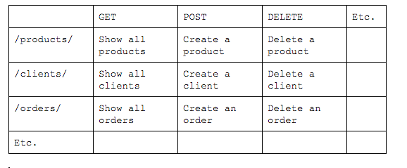

# Tips for a great API design #

December 15th, 2015

Jeroen Freijer <jeroen@redcenter.nl>


##Audience check##

First we have to check for readers who landed on this page, because of a typo. I don’t want to confuse or disappoint them.

* Are you here because you want to know about India Pale Ale? Please visit https://en.wikipedia.org/wiki/India_pale_ale and enjoy!
* Are you looking for cheap tickets to Pakistan? Go to the PIA website: http://www.piac.com.pk/
* Are you Dutch and into monkeys? Go make a donation here: https://www.aap.nl/


##<TL;DR>##


For those who are in a hurry and only want the highlights, here is your TL;DR (or like we used to say in a different era: the management summary).

Is your team building an API? Force them to start with a proper API design. Here is a checklist:

* REST
* JSON
* Forget the user!
* Endpoint Method Matrix
* Expand
* Query params
* Only https
* Endpoints
* Status codes
* Versioning
* Hypermedia
* API keys

Make sure your API team says ‘yes’ to every item and you are good to go!


##<Knowledge check>##

* You know what an API is
* You know why the following requirement is ridiculous: *"The API must be responsive and compatible for all major browsers"*
* You know about the HATEOAS principle
* You know the difference between a collection resource and a singleton or instance resource


Well, let’s start. 


------

##Contents

* [REST is the best](#markdown-header-rest-is-the-best)
* [Don't know your user!](#markdown-header-do-not-know-your-user)
* [JSON rules](#markdown-header-json-rules)
* [Endpoints are the beginning](#markdown-header-endpoints-are-the-beginning)
* [Use an EMM](#markdown-header-use-an-emm)
* [Use the status codes](#markdown-header-use-the-status-codes)
* [Use versioning from the start](#markdown-header-use-versioning-from-the-start)
* [Only HTTPS](#markdown-header-only-https)
* [API keys are the key](#markdown-header-api-keys-are-the-key)
* [Hypermedia is not a hype](#markdown-header-hypermedia-is-not-a-hype)
* [Be eloquent and verbose](#markdown-header-be-eloquent-and-verbose)
* [Query params are king!](#markdown-header-query-params-are-king)
* [Conclusion](#markdown-header-conclusion)

------


##REST is the best##
The mother of all tips: choose REST. Of course SOAP and other protocols like XML-RPC are nice and in very specific situations the best choice, but in general: pick REST. It is flexible, user friendly, easy to use, etc.  


Do you want to know more about REST, these are my favorites:

* A video from the CTO of Stormpath (1:24) : https://youtu.be/hdSrT4yjS1g
* The API bible from Brian Mulloy: http://apigee.com/about/resources/ebooks/web-api-design

[back to contents](#markdown-header-contents)

------

##Do NOT know your user!

Most API designers try to understand their API users. **WHY** are they going to use our data and business intelligence? **WHAT** motivates them? 

I say: *"Don’t do that! Are you nuts?"*. Because it is not important for the design phase. You just have to know **WHAT** data they need, not **WHY**. 

First, because it makes it easier for yourself. And that should always be rule number one! :-)

Second, trying to make it easier for a user and predict what they will do, usually results in **restricting** a user. Just provide the data they need in a easy-to-use fashion and these users will surprise you in what they can do with the data.


So treat your users, like they are anonymous...


[back to contents](#markdown-header-contents)

------

##JSON rules
Both requests and responses: communicate both in JSON. So do not ask users to POST multipart/formdata, etc. They only have to provide a body with a JSON payload and the correct content-type.

And when you return a response, make sure it has a nice, well-structured JSON payload (‘pretty json’ of course).

####How about other response formats like XML?
Of course it sounds nice if your API returns all kinds of formats: xml, csv, json, html… And you can always build this in the future. Just stick to JSON first and do that 100%.

####Why always pretty json?
It makes it easier for everybody. Do not listen to people who tell you ‘pretty json’ is a waste of data. If you are connecting to an external API or debugging it, what is a nicer response:

    {"status":404,"message":"Resource not found","meta":{"IP":"127.0.0.1", "method":"GET"}}

… or this ...

    {
       "status": 404,
       "message": "Resource not found",
       "meta": {
          "IP": "127.0.0.1",
          "method": "GET"
       }
    }


[back to contents](#markdown-header-contents)

------

##Endpoints are the beginning
Make sure your API endpoints are named correctly. Never use verbs and always use plural nouns. And (already mentioned) do not assume anything about how the data is used.

EXAMPLE

    Good
    /v1/products/
    
    Bad
    /v1/allProducts
    /v1/productById
    /v1/productsByClient
    /v1/clientListForDashboard

I can hear a question coming up: *“Why is productById a bad endpoint? How can the client ask for a specific product?”*

The answer lies in the good endpoint example: `/v1/products/`

If you get more familiar with REST, you will see the idea behind this endpoint. The endpoint returns all products by default. If you only want a specific product based on an id (bad example 2), you add a filter for that attribute.

Like this: `/v1/products/?id=2345`

If you want all products for a specific client (bad endpoint 3), you add a filter for client:

Like this: `/v1/products/?client=acme`

So all the bad endpoints in the example (and the needs behind) can be fulfilled with just one endpoint: 

    /v1/products/

If this still confuses you a bit, don’t worry. Read more articles on REST (like the ones I shared earlier in this article) and you will get it.

[back to contents](#markdown-header-contents)

------

##Use an EMM
When you are designing a brand new API, try to design an endpoint method matrix (EMM) first. 

*What’s that, you ask?* Let me explain.

As you know, REST is all about endpoints and HTTP methods. Every combination between those two dimensions has a functional meaning and implies something specific.

The endpoint says something about the subject of the request. The HTTP method says something about what the user want to do with the subject.

Example: A `POST` method on the endpoint `/products/` means the user wants to create a new product. A `GET` request on the same endpoint means the user wants a list of all products in the system.

So two different HTTP methods on the same endpoint mean something completely different.

So before you start building an API, first draw a matrix with all possible “endpoint vs method“ combinations. For every combination you decide if you need it or not.

Let's draw one right now:



Now you have the EMM, you can decide for every combination if you want to design it. You can also use the same matrix for connecting all user stories to specific combinations, you can prioritize which combinations to build first, etc.

Example: an API to facilitate a webshop probably does not need an endpoint to delete or create products, but creating an order is top priority!

So I would always start with a detailed EMM. It is a great framework to communicate your ideas to all stakeholders and structure your project.

[back to contents](#markdown-header-contents)

------

##Use the status codes
Remember HTTP Status codes, like 200, 500, 404, 301, etc. ?

Well, use them to tell your users what is happening. That’s exactly why they were invented. Every response must start with a official HTTP status code that tells your users what is going on.

Do you have trouble remembering what status code to choose? Michael Kropat from Racksburg.com wrote a very good article about it: http://racksburg.com/choosing-an-http-status-code/

And, make sure you always include the following codes somewhere in your API as an easter egg: 

    450 -> Blocked by Windows Parental Controls
    418 -> I’m a teapot

For a list of all HTTP status codes, click here: https://en.wikipedia.org/wiki/List_of_HTTP_status_codes

[back to contents](#markdown-header-contents)

------

##Use versioning from the start
Always have the version number in the endpoint tree, like...

    /v1/products/
    /v3.14/pies/

Trying to add this after people start using your API will be… difficult. Trust me.

[back to contents](#markdown-header-contents)

------

##Only HTTPS
From the start use HTTPS for all servers. No need to explain, just do it.


[back to contents](#markdown-header-contents)

------

##API keys are the key
Please consider using API keys for people to use the API, instead of user / password combinations. It is much easier to give a user multiple API keys for multiple uses, it’s more secure, you can revoke access easier without changing the user credentials, etc.

[back to contents](#markdown-header-contents)

------

##Hypermedia is not a hype
Every resource that you publish through your API must contain hypermedia to communicate the inner-structure of your API. It does not have to be too complex, it can start very simple by adding links to every resource you publish.

Let's see...

    {
       "status": 200,
       "href": "https://api.domain.com/v1/products/",
       "meta": {
          "IP": "127.0.0.1",
          "method": "GET"
       },
       "products": [
          {
             "id": "4321",
             "href": "https://api.domain.com/v1/products/4321",
             "title": "product A"
          },
          {
             "id": "1234",
             "href": "https://api.domain.com/v1/products/1234",
             "title": "product B"
          }
       ]
    }

You can see the collection resource itself has a HREF, but also the individual resources in the products container have them. Functionally, these href attributes are hyperlinks to the resource itself.

Remember, this is a very simple example! Depending of the type of business that you run, the hypermedia can be very complex. 

If you have a webshop API, resources can contains other types of links as well. Let’s say you have an order endpoint. The response could be something like this:

    {
       "status": 200,
       "id": "12345",
       "amount": 201.99,
       "links": {
          "self": "https://api.domain.com/v1/orders/12345",
          "pay": "https://api.domain.com/v1/orders/12345/payment",
          "cancel": "https://api.domain.com/v1/orders/12345/cancel",
          "products": "https://api.domain.com/v1/orders/12345/products/"
       }
    }

The links container describes the next actions that are possible. This is a very powerful concept, because your users do not have to know all the endpoints or hard-code them. The API is self-explanatory in this regard.

And you, as an API builder, can decide to change one of the endpoint without problems! Because nobody hard-coded them… :-)

Again: this is just a small example to give you an idea about this concept. There is much more to say about hypermedia, HATEOAS, etc...

[back to contents](#markdown-header-contents)

------

##Be eloquent and verbose
The users of your API are like you. They are fellow developers. They are the primary users of the stuff you are designing right now. Again: the guys and girls who will build an interface for your API are just like you. Be aware of this. 

Try to remember what you hated the last time you tried to connect to an external API. Try to avoid making the same mistakes. It will help you create a better API.

You know what I usually hate about third-party API’s? The error messages. Most of them are like ‘Error occurred’ or ‘Server error’... Duh!


Always provide eloquent messages, use correct status codes and try to give a solution in your error messages.

    {"status": 200,"message": "Something went wrong. Try again."}

versus

    {
       "status": 400,
       "message": "There was a validation error. The input 'email' was invalid. Please see the documentation '/v1/documentation' for details about validation rules for this endpoint."
    }

Really, it is those details that make your API awesome to use!

[back to contents](#markdown-header-contents)

------

##Query params are king!
Think of the products endpoint we used in previous examples:

    /v1/products/

! sidestep alert !
Do you see the trailing slash? Don’t forget to deal with it, because a trailing slash actually means something! It’s the difference between a collection resource and a singleton resource. I really hate it when API designers forget it or think it’s irrelevant. I could start a whole discussion on it now, but I won’t.

But let me tell you: I really love Laravel, but the fact it is deleting a trailing slash by default, makes me sad… 

Just remember, for an API it is important. And a brilliant framework like Laravel should address it, instead of closing a discussion about it with the remark ‘just don’t use a trailing slash’... 

https://github.com/laravel/framework/issues/23

! end of sidestep !

Back to the topic of a products endpoint and query parameters.

A `GET` request on the endpoint gives all products. That’s default behaviour. Now we are going to add query parameters to that endpoint and it will open up lots of opportunities. Let me show you.


Let’s get a subset and add limit and offset to the endpoint:

    /v1/products/?offset=30&limit=10


Let’s get all products where the title contains a string

    /v1/products/?title=qwerty


Let’s get all products where the customerid is exactly 12345

    /v1/products/?customer_id=12345


Let’s do a global search on all product attributes

    /v1/products/?q=qwerty


Let’s get all products, but only return specific fields

    /v1/products/?fields=title,id,description


Let’s get all products, but sort on title

    /v1/products/?sort=title


Let’s get all products, but sort on title descending

    /v1/products/?sort=-title


Of course users can combine all kinds of query parameters to fit their needs:

    /v1/products/?sort=-title&q=qwerty&offset=15&limit=15

####The expand parameter
One query parameter I want to address separately: the “expand” parameter.

Let’s start with an example (again)... We have a order endpoint

```
    GET /v1/orders/12345 
    
    {
       "status": 200,
       "id": "12345",
       "href": "https://api.domain.com/v1/orders/12345",
       "amount": 201.99,
       "customer": {
          "id": "54321",
          "href": "https://api.domain.com/v1/customer/54321"
       }
    }
```

Imagine we want to render a page with the order data, but also show some customer data (a first name). It will take an extra request (to the customer endpoint) to get all details about the connected customer. 

What if you could get it in the original request? Let's do that...


```
    GET /v1/orders/12345?expand=customer
    
    {
       "status": 200,
       "id": "12345",
       "href": "https://api.domain.com/v1/orders/12345",
       "amount": 201.99,
       "customer": {
          "id": "54321",
          "href": "https://api.domain.com/v1/customer/54321",
          "firstName": "Jay",
          "lastName": "Fray",
          "gender": "male"
       }
    }
```


So the expand parameter makes it possible to expand nested resources and save on additional requests.

Some API designers might say: *“Why not always expand all nested resources?”* 

And I say *“Why introduce (possibly) massive responses if extra that data is not always consumed? Make it easy for your users to expand when they need it.”*

[back to contents](#markdown-header-contents)

------


##Conclusion


These tips are based on my own experience with designing multiple APIs for several companies, some of them high-availability. Of course every API has its own requirements and you should always see these tips as guidelines, not rules.

Except for the easter egg tip: that’s a rule… obviously.

Good luck designing your API and let me know about your experiences!


And many thanks to Luca Sottani for proof reading it and giving his feedback. 

[back to contents](#markdown-header-contents)